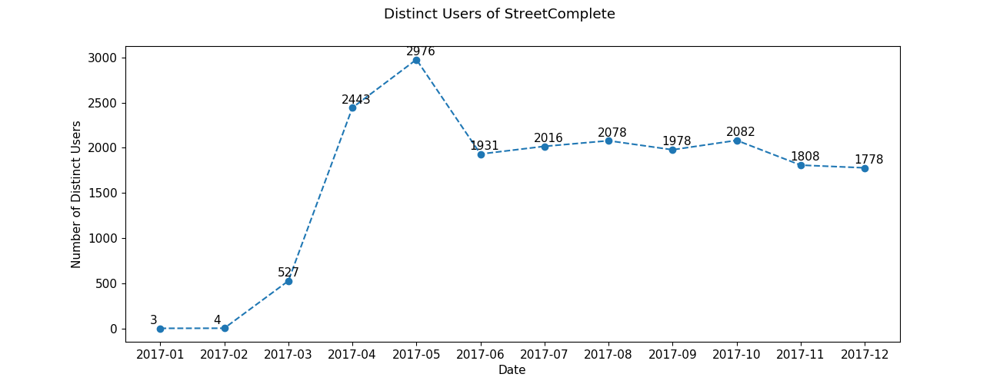

# OpenStreetMap Tool Statistics

This project should enable those who are interested in the usage of OpenStreetMap editors to create simple usage graphs for a particular editor. This is similar to what is done on the [OSM wiki's editor stats page](https://wiki.openstreetmap.org/wiki/Editor_usage_stats) but aims to provide more fine-grained information about single editors. This way, software maintainers or community members can observe how an editor evolved over time and can try to draw conclusions about incidents and their impacts.

## Functionality

Currently `osm_editor_graphs.py` creates three graphs showing how the number of changesets, the number of edits, and the number of distinct users of a given editor changed over time.

Run `./osm_editor_graphs.py --help` for a list of available options.

## Usage

This software currently processes the results of the [editor-stats](https://github.com/Zverik/editor-stats) tools, which are also used to generate the data for the OSM wiki's editor stats page. Therefore, it is necessary to run these tools on the [Planet OSM](https://planet.openstreetmap.org/) changesets file beforehand.

Example:

```bash
# assume editor-stats and this project are cloned locally
# create folder for data
mkdir data
# download latest changeset file from planet.osm
wget -P data https://planet.openstreetmap.org/planet/changesets-latest.osm.bz2
# convert to csv using editor-stats
bzcat data/changesets-latest.osm.bz2 | editor-stats/xml2csv.pl > data/changesets.csv
# generate .lst files using editor-stats, e.g. for each month in 2017
for i in `seq -w 1 12`; do
    cat data/changesets.csv | editor-stats/stats.pl 2017-$i > data/2017-$i.lst
done
# generate graphs using this tool, e.g. for editor StreetComplete
osm-tool-stats/osm_editor_graphs.py -e StreetComplete --outdir data data/*.lst
```

This is how an example graph for the number of users may look like:



## Misc

It may be necessary to tune the plotting a little bit. Maybe further functionality will be added later. Pull Requests are welcome.
